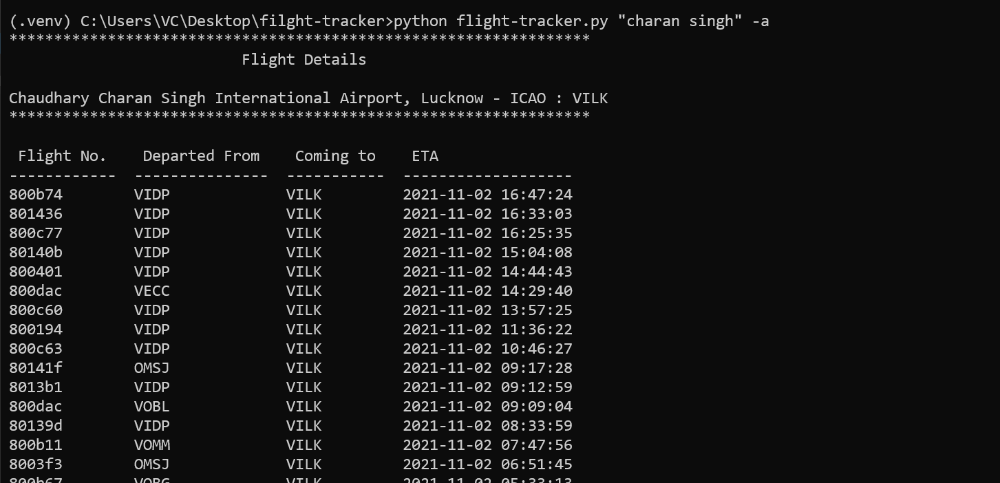
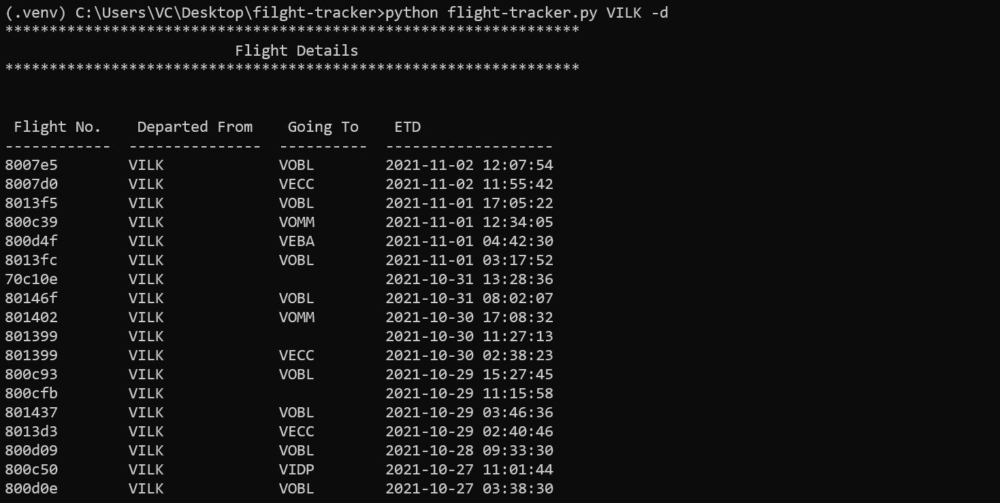

# Flight Tracker


## Project Description

It is a command-line utility and slack bot developed in python where user can either run it using command line or can run */slash commands* by deploying it. This project uses [OpenSky REST API](https://opensky-network.org/apidoc/rest.html) and Paytm Flight API.


## Installation


- ### Command-line

1. Clone the repository and navigate to `flight-tracker` directory.
```
git clone https://github.com/vipin0/filght-tracker.git
```
  
2. Install the required dependencies.
```
pip install -r requirements.txt
```
3. Run it as a command-line application.
```
python flight-tracker.py -a 'LKO'
```
<hr>

- ### As a server for slack

1. Clone the repository and navigate to `flight-tracker` directory.
```
git clone https://github.com/vipin0/filght-tracker.git
```
  
2. Install the required dependencies.
```
pip install -r requirements.txt
```
3. It's takes the following environment variables, create a file `.env` with the content of `.env.sample`.
```
SLACK_BOT_TOKEN=your-bot-token
SLACK_SIGNING_SECRET=your-signing-secret
PORT=4444
```
4. Start the development server.
```
python slack_bot.py
```
## Usage


- ## For Slack_Bot
#### Available /[slash]commands
- **/get_flights** *origin_code* *destination_code* *[YYYY-MM-DD]* *[no_passengers]* *[travel_class]*

 This command list all the flights between given airports on gievn date.

 You must provide origin airport code and destination airport code.<br>
    Default search date to today\'s date.<br>
    Default no_passengers is 1<br>
    Default travel_class is \'E\' or you can use \'B\'.

 - **/list_arrivals** *airport_code* *[begintime]* *[endtime]*

 This list all the flights arriving on the given airports.

 - **/list_departures** *airport_code* *[begintime]* *[endtime]*

 This list all the flights departing from the given airports.

 - **/help** 

 This command show the help menu for the bot.
<hr>

 - ## For command-line 

 ```
Usage: 

  $ python flight-tracker.py [OPTIONS] AIRPORT_CODE

  Options:
  -a, --arrival           list the arriving airplanes to the given airport.
  -d, --depart            list the depaturting airplanes from the given
                          airport.
  -b, --begin [%Y-%m-%d]  starting date in Y-m-d i.e. 2021-12-12
  -e, --end [%Y-%m-%d]    ending date in Y-m-d i.e. 2021-12-12
  --help                  Show this message and exit.

```

## CLI Reference
  *By default the script show all the airplanes within the time interval of `7 days`.*

  **Changing time interval**
  
    Use -b/--begin or -e/--end for changing date.
  
  *Example*
  ```
  $ python flight-tracker.py -a LKO -b 2021-10-30 -e 2021-11-02
  
  or
  
  $ python flight-tracker.py -a LKO --begin 2021-10-30 --end 2021-11-02


  ```

  **Arrivals**

    Use -a or --arrival flag to list all the arriving airplanes.
  
  *Example*

  ```
  $ python flight-tracker.py -a LKO
  ```

  **Departures**

    Use -a or --arrival flag to list all the departing airplanes.
  
  *Example*

  ```
  $ python flight-tracker.py -d LKO
  ```

## Dependencies
This project is uses the following third-party dependencies.
```
slackclient
slackeventsapi
flask
requests
click
tabulate
```


## Sample outputs
 #### Arrivals
 <br>
 
 #### Departures
 


