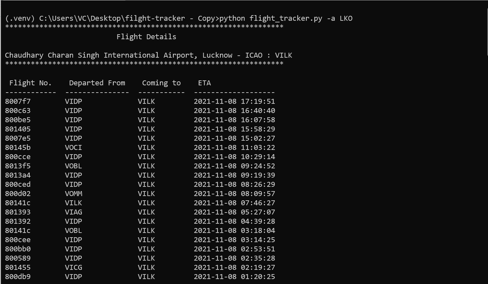
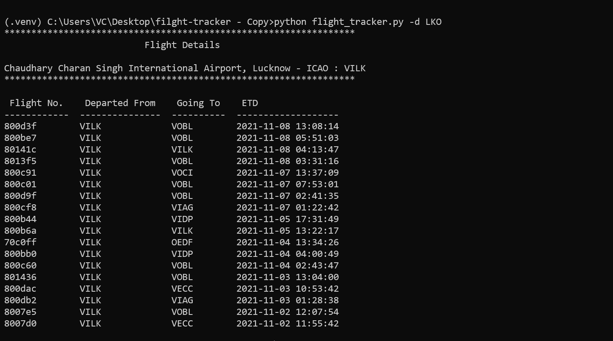

# Flight Tracker


## Project Description
It is a command-line utility developed in python which list arrival and departure information for any airport in the world for the time interval of 7 days. This project uses [OpenSky REST API](https://opensky-network.org/apidoc/rest.html)


## Installation
todo


## Usage

```
Usage:

    $ python test-click.py [OPTIONS] AIRPORT

    Options:
    -a, --arival      to list the arivals.
    -d, --depart      to list the depatures.
    -b, --begin TIME  starting time.
    -e, --end TIME    ending time.
    --help            Show this message and exit.

```

## Dependencies
This project is uses the following third-party dependencies.
```
requests
click
tabulate
```

## Sample outputs
 #### Arrivals
 <br>
 
 #### Departures
 
